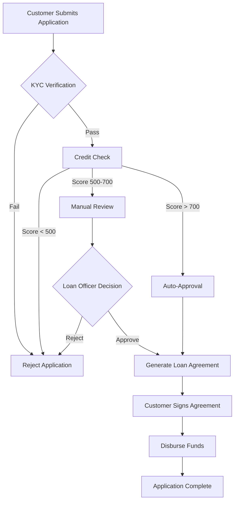
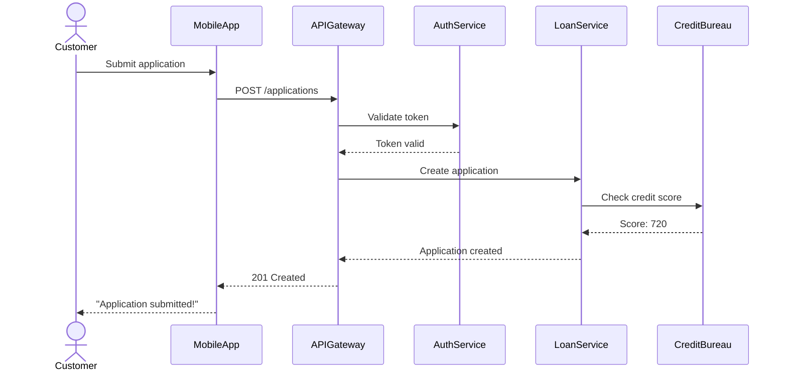
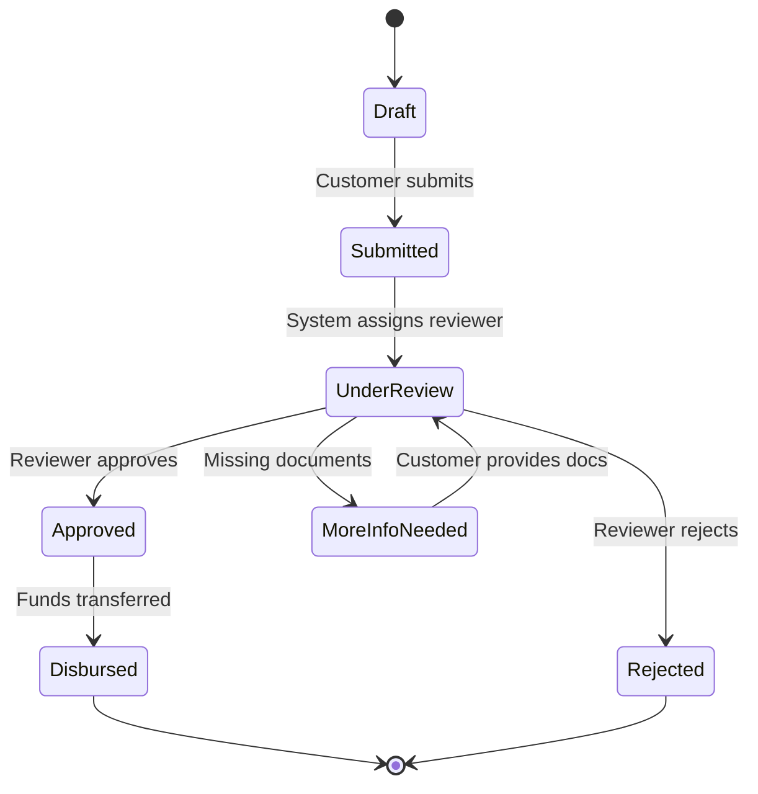
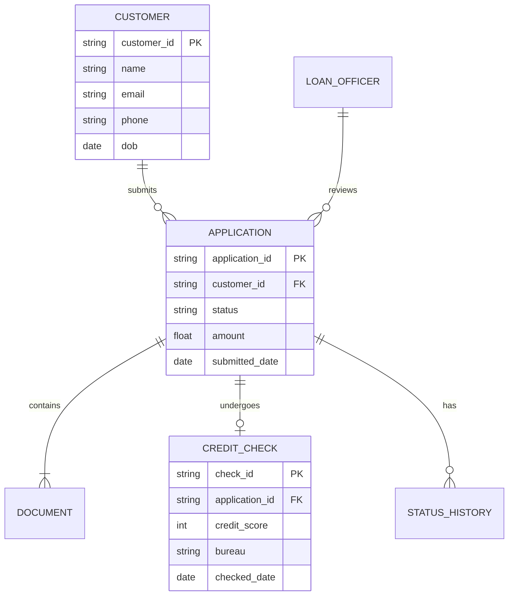
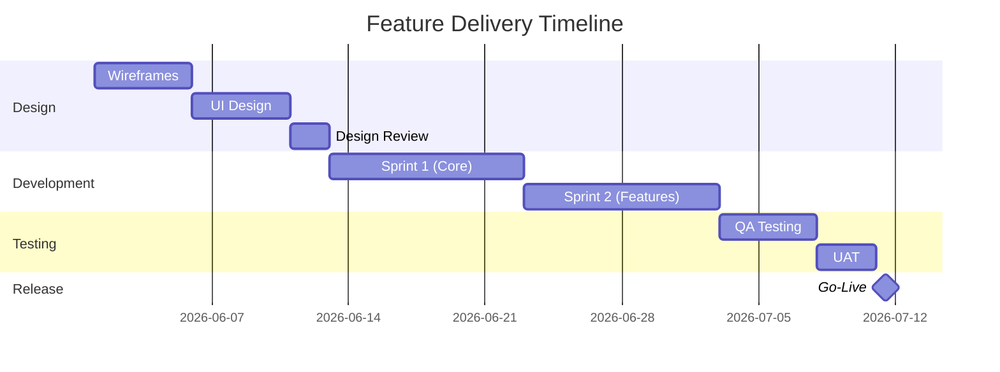
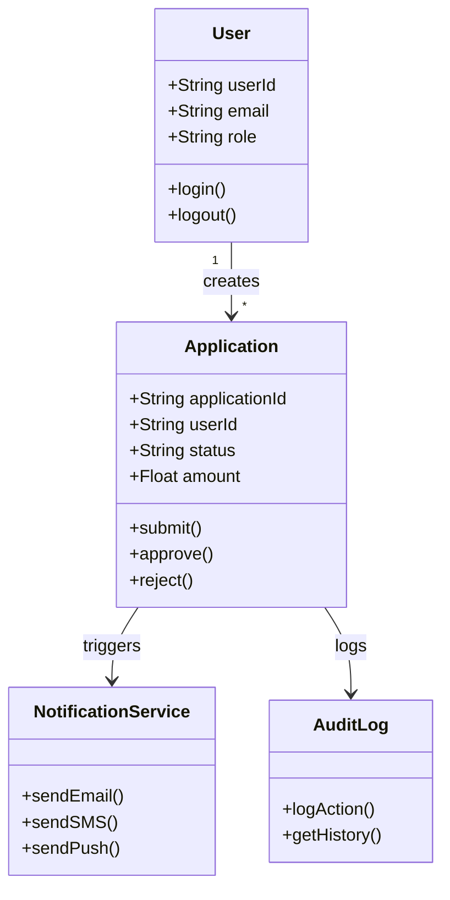
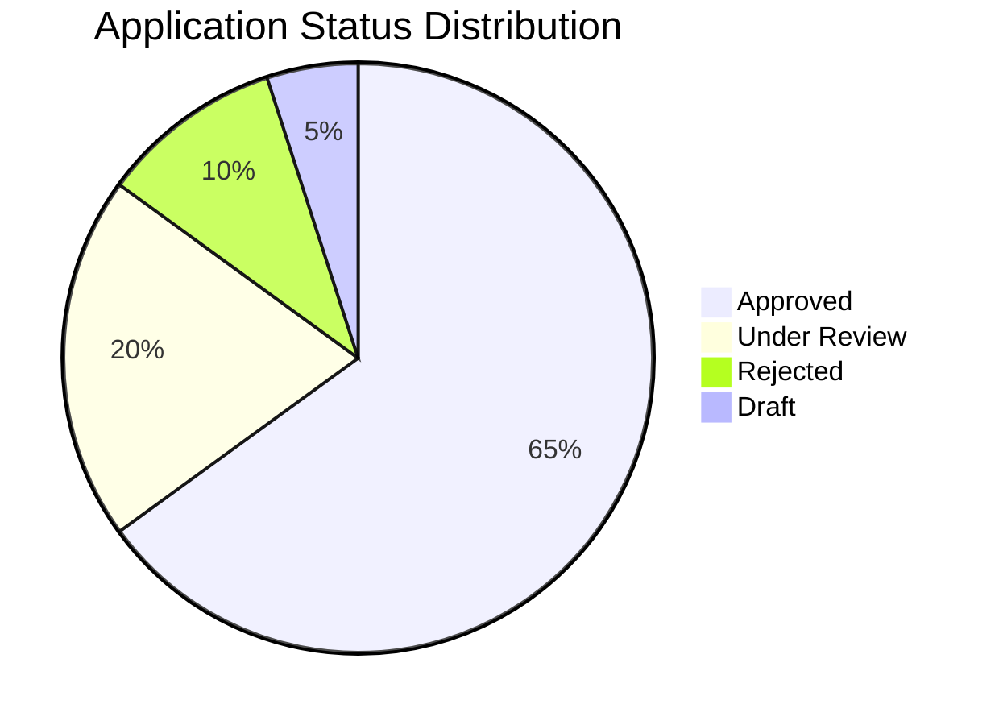
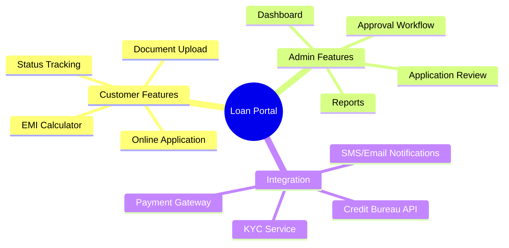

# Mermaid Diagram Examples for BAs and POs
*By Touseef Shaik — touseefshaik.com*

---

These examples render natively in GitHub, GitLab, Notion (with Mermaid plugin), Confluence (with Mermaid macro), and any Markdown editor. Copy, paste, and adapt.

---

## 1. Flowchart — Loan Application Process

**When to use:** End-to-end business process visualization. Stakeholder-friendly.

---

## 2. Sequence Diagram — API Integration Flow

**When to use:** System integration design, API contract discussions, microservice communication.

---

## 3. State Diagram — Order / Application Lifecycle

**When to use:** Entity lifecycle, status workflows, anything with clear state transitions.

---

## 4. Entity Relationship (ER) — Data Model Sketch

**When to use:** Data model discussions, database design, system architecture reviews.

---

## 5. Gantt Chart — Project Timeline

**When to use:** Sprint planning, roadmap presentations, stakeholder timeline discussions.

---

## 6. Class Diagram — System Architecture

**When to use:** High-level system design, architecture review, onboarding new developers.

---

## 7. Pie Chart — Data Visualization

**When to use:** Dashboard mockups, stakeholder presentations, data snapshots.

---

## 8. Mindmap — Feature Breakdown

**When to use:** Brainstorming sessions, feature scoping, stakeholder alignment workshops.

---

## Tips for Using Mermaid in BA/PO Work

1. **Paste into markdown** — Mermaid renders in GitHub, GitLab, Notion (plugin), Confluence (macro).
2. **Use BA Assistant to auto-generate** — describe your system in plain English and get Mermaid flowcharts, sequence diagrams, and state diagrams in the output.
3. **Start simple** — a 5-node flowchart is more useful than a 30-node diagram nobody reads.
4. **Version control your diagrams** — since Mermaid is plain text, it diffs beautifully in git.
5. **Label everything** — unclear diagram labels are worse than no diagram.

---

*This resource is part of the free BA/PO Toolkit from touseefshaik.com/resources. For AI-powered Mermaid diagram generation, try BA Assistant at tshaik1990-ba-assistant.hf.space.*
